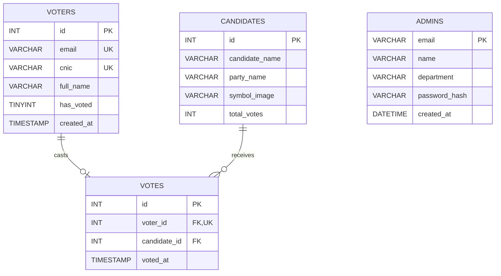

# Secure Digital Voting System

A government-portal-style **online voting platform prototype** built with
**Next.js + Tailwind CSS** on the frontend and **Express.js (Object-Oriented)** on
the backend, backed by a **MySQL 8** database. Designed as a university final-year
project that demonstrates a clean separation of concerns, OOP discipline on both
sides of the wire, and a real (not in-memory) persistence layer.

> **Voter flow:** Landing → Email + OTP → Verify CNIC → Confirm Name → Select Candidate → Animated Success
>
> **Admin flow:** Admin Login → Dashboard (live tallies, voter roster, audit log)

---

## Tech Stack

| Layer    | Stack                                                                       |
| -------- | --------------------------------------------------------------------------- |
| Frontend | Next.js 15 (App Router) · React 19 · TypeScript · Tailwind CSS · lucide-react |
| Backend  | Node.js · Express 4 · Object-Oriented JavaScript (ES2022 classes)           |
| Database | MySQL 8 via `mysql2/promise` connection pool                                |
| Auth     | EmailJS one-time-passcode delivery · in-memory OTP manager · admin session  |
| Anim.    | Framer Motion page transitions + Tailwind / CSS keyframe utilities          |

---

## Database

The backend stores all persistent state in **MySQL 8**. The schema lives in
[`express-backend/schema.sql`](express-backend/schema.sql) and is executed once
in MySQL Workbench (or any client). On startup the backend verifies that every
required table exists, adds the `UNIQUE(voter_id)` constraint on `votes` if
it's missing, and seeds the `candidates` table the first time it's empty.

### Tables

| Table        | Purpose                                                          |
| ------------ | ---------------------------------------------------------------- |
| `voters`     | Registered citizens. Unique on `email` and `cnic`.               |
| `candidates` | Ballot roster. Auto-seeded with four demo candidates.            |
| `votes`      | One row per cast ballot. `UNIQUE(voter_id)` blocks double votes. |
| `admins`     | DB-backed admin accounts. Falls back to env vars when empty.     |

### Entity-Relationship Diagram



**Relationship summary**

- `voters (1) ──┬── (0..1) votes` — a voter may cast at most one vote (enforced
  by `UNIQUE(voter_id)` on the `votes` table).
- `candidates (1) ──┬── (0..N) votes` — a candidate can receive many votes.
- `admins` is standalone — used only for sign-in to the admin dashboard.

### Configuration

Database credentials live in `express-backend/.env`:

```env
DB_HOST=localhost
DB_PORT=3306
DB_USER=root
DB_PASSWORD=your_password
DB_NAME=voting_system
PORT=5000

# Admin login fallback (used when the `admins` table is empty)
ADMIN_EMAIL=admin@example.com
ADMIN_PASSWORD=admin123
```

---

## Repository Layout

```
Uni-Project/
├── express-backend/                  ← Express.js API (Object-Oriented)
│   ├── .env                          ← DB credentials (gitignored)
│   ├── schema.sql                    ← MySQL schema reference
│   ├── package.json
│   └── src/
│       ├── server.js                 ← App entry, wires services, mounts routes
│       ├── db.js                     ← MySQL pool + startup checks + seeding
│       ├── routes/index.js           ← REST endpoints
│       ├── scripts/check-db.js       ← `npm run db:check` connectivity probe
│       ├── controllers/              ← HTTP layer
│       │   ├── authController.js
│       │   ├── candidateController.js
│       │   ├── voteController.js
│       │   └── adminController.js
│       ├── services/                 ← Business logic + OOP core
│       │   ├── AuthenticationService.js
│       │   ├── VoteManager.js
│       │   ├── VoteStore.js          ← abstract base
│       │   ├── UserStore.js          ← abstract base
│       │   ├── AdminStore.js         ← abstract base
│       │   ├── InMemoryVoteStore.js  ← demo concrete impl
│       │   ├── MysqlVoteStore.js     ← MySQL concrete impl
│       │   ├── MysqlVoterStore.js
│       │   ├── MysqlCandidateService.js
│       │   └── MysqlAdminStore.js
│       └── models/                   ← Domain classes
│           ├── Person.js             ← abstract base
│           ├── User.js               ← extends Person
│           ├── Admin.js              ← extends Person
│           ├── Candidate.js          ← extends Person
│           └── Vote.js               ← immutable value object
│
└── nextjs-frontend/                  ← Next.js App Router UI
    ├── .env.local.example            ← Frontend env template
    ├── package.json
    └── src/
        ├── app/
        │   ├── page.tsx              ← Landing
        │   ├── auth/
        │   │   ├── email/            ← Step 1: capture email, send OTP
        │   │   └── otp/              ← Step 2: enter 6-digit code
        │   ├── verify/               ← Step 3: CNIC
        │   ├── identity/             ← Step 4: name confirmation
        │   ├── ballot/               ← Step 5: candidate selection
        │   ├── success/              ← Step 6: confirmation + receipt
        │   ├── admin/
        │   │   ├── login/            ← Admin sign-in form
        │   │   └── dashboard/        ← Tallies, voter table, audit log
        │   ├── api/admin/login/      ← Next.js route handler for admin auth
        │   ├── layout.tsx
        │   └── globals.css           ← Theme + CSS animations
        ├── components/               ← Reusable UI
        │   ├── ui/                   ← Button, Card, Input, Label, Alert
        │   ├── site-header.tsx
        │   ├── site-footer.tsx
        │   ├── brand-mark.tsx
        │   ├── step-indicator.tsx
        │   ├── candidate-symbol.tsx
        │   ├── page-transition.tsx   ← framer-motion route transitions
        │   ├── animated-error.tsx
        │   ├── theme-provider.tsx
        │   └── theme-toggle.tsx
        └── lib/
            ├── api.ts                ← Typed Express client
            ├── session.ts            ← sessionStorage helper
            ├── utils.ts
            └── oop/                  ← Frontend OOP layer (mirrors backend)
                ├── Person.js
                ├── User.js
                ├── Admin.js
                ├── Candidate.js
                ├── OTPManager.js
                ├── AuthenticationManager.js
                ├── VoteManager.js
                ├── AdminAuthManager.js
                ├── DashboardManager.js
                └── index.js          ← Barrel export
```

---

## OOP Concepts Demonstrated

The project intentionally exercises the four pillars of OOP on **both** sides
of the wire. Backend classes own the persisted/business state; frontend classes
own the client-side session flow.

| Concept       | Where in code                                                                                                                  |
| ------------- | ------------------------------------------------------------------------------------------------------------------------------ |
| Abstraction   | `Person` (abstract, throws if instantiated). `VoteStore`, `UserStore`, `AdminStore` define contracts; consumers depend on them. `AuthenticationService` and `DashboardManager` hide multi-step flows behind a single object. |
| Inheritance   | `User`, `Admin`, `Candidate` all `extends Person`. `MysqlVoteStore` / `InMemoryVoteStore` extend `VoteStore`. Mirrored in `nextjs-frontend/src/lib/oop`. |
| Encapsulation | All model fields use `#private` class fields, exposed via getters. `Vote` is `Object.freeze`d. `OTPManager` keeps codes/expiry/attempts private. |
| Polymorphism  | `Person#getRole()` overridden per subclass (`Admin` also overrides `getDisplayName`). `VoteManager` accepts any `VoteStore` via constructor injection — same code talks to in-memory or MySQL. |

> Comments inside each class file explicitly call out which OOP concept it demonstrates.

---

## REST API

Base URL: `http://localhost:5000/api`

### Voter endpoints

| Method | Path                  | Body / Params                        | Purpose                                           |
| ------ | --------------------- | ------------------------------------ | ------------------------------------------------- |
| POST   | `/verify-cnic`        | `{ cnic }`                           | Validates the CNIC (13 digits, dashes optional).  |
| POST   | `/save-user`          | `{ cnic, name }`                     | Registers the voter's display name.               |
| GET    | `/candidates`         | —                                    | Returns all candidates.                           |
| POST   | `/cast-vote`          | `{ cnic, candidateId }`              | Casts a vote. Rejects duplicates with 409.        |
| GET    | `/vote-status/:cnic`  | path param                           | Returns `{ hasVoted: boolean }`.                  |

### Admin endpoints

| Method | Path                  | Body / Params                        | Purpose                                           |
| ------ | --------------------- | ------------------------------------ | ------------------------------------------------- |
| POST   | `/admin/login`        | `{ email, password }`                | DB-backed admin sign-in (falls back to env vars). |
| GET    | `/admin/stats`        | —                                    | Live per-candidate tallies + percentages.         |
| GET    | `/admin/voters`       | —                                    | Voter roster + cast-vote status.                  |

All responses are JSON with a `success: true | false` flag.

Email + OTP delivery and the admin login proxy live in Next.js (EmailJS on the
client; `/api/admin/login` route handler on the server). Express is the single
source of truth for everything that touches MySQL.

### Demo CNIC

Any 13-digit value works because there is no NADRA lookup in the prototype.
Example: `35201-1234567-1`.

---

## Running Locally

### Prerequisites

- **Node.js 20+**
- **MySQL 8** (XAMPP, standalone, or Docker — anything reachable on `localhost:3306`)
- **MySQL Workbench** (or any SQL client) for the one-time schema setup

### 1. Database setup

Open MySQL Workbench and run [`express-backend/schema.sql`](express-backend/schema.sql).
This creates the `voting_system` database and all four tables. The backend
will refuse to start if any table is missing.

### 2. Backend

```bash
cd express-backend
cp .env.example .env       # or create .env manually (see Configuration above)
npm install
npm run dev                # node --watch src/server.js
# → API listening on http://localhost:5000
```

Sanity-check the connection with:

```bash
npm run db:check
```

### 3. Frontend

```bash
cd nextjs-frontend
cp .env.local.example .env.local     # then fill in EmailJS keys + admin creds
npm install
npm run dev
# → UI on http://localhost:3000
```

Frontend environment variables (`.env.local`):

```env
NEXT_PUBLIC_API_URL=http://localhost:5000/api
NEXT_PUBLIC_EMAILJS_SERVICE_ID=...
NEXT_PUBLIC_EMAILJS_TEMPLATE_ID=...
NEXT_PUBLIC_EMAILJS_PUBLIC_KEY=...
ADMIN_EMAIL=admin@example.com
ADMIN_PASSWORD=admin123
```

> The EmailJS keys are optional — leaving the demo placeholders in place puts
> the app in **demo mode** where the OTP is shown on screen and in the console
> instead of being emailed.

Open <http://localhost:3000>, click **Proceed to Vote**, and walk the flow.
The admin dashboard is reachable at <http://localhost:3000/admin/login>.

### Production build

```bash
# Frontend
cd nextjs-frontend && npm run build && npm start

# Backend
cd express-backend && npm start
```

---

## Deploying to Vercel (frontend only)

The Next.js frontend is Vercel-ready. The Express backend + MySQL must be
hosted elsewhere (Render, Railway, etc.) because Vercel only runs short-lived
serverless functions, not a long-running Express server.

1. Push the repo to GitHub (already done).
2. Go to <https://vercel.com/new>, import the repo.
3. In **Configure Project**, set **Root Directory** to `nextjs-frontend`.
4. Leave Framework Preset as **Next.js** (auto-detected).
5. Add the following **Environment Variables**:

   | Name                              | Value                                            |
   | --------------------------------- | ------------------------------------------------ |
   | `NEXT_PUBLIC_API_URL`             | Public URL of your deployed Express backend, or leave the demo placeholder if backend isn't hosted. |
   | `NEXT_PUBLIC_EMAILJS_SERVICE_ID`  | EmailJS service id (or `demo_service_id`).       |
   | `NEXT_PUBLIC_EMAILJS_TEMPLATE_ID` | EmailJS template id (or `demo_template_id`).     |
   | `NEXT_PUBLIC_EMAILJS_PUBLIC_KEY`  | EmailJS public key (or `demo_public_key`).       |
   | `ADMIN_EMAIL`                     | Admin login email.                               |
   | `ADMIN_PASSWORD`                  | Admin login password.                            |

6. Click **Deploy**. Vercel runs `npm run build` and hosts the static + serverless output.

> ⚠️ Without a hosted backend, the voter API calls (`verify-cnic`, `cast-vote`, etc.)
> will fail — the landing, OTP UI, admin login form, and theming still work.

---

## Frontend Highlights

- **Government-portal theme** — deep-green primary, cream background, gold accent,
  guilloche-grid background, and an official top stripe.
- **Step indicator** showing progress through Email → OTP → Verify → Identity → Ballot → Success.
- **Candidate cards** with party-colored symbols.
- **Framer Motion page transitions** between every step in the flow.
- **CSS-keyframe animations** for fade-up, scale-in, draw-check SVG checkmark,
  pulse-ring success burst, and shimmer skeletons for loading states.
- **Light / dark theme toggle** via `next-themes`.
- **Admin dashboard** with live vote tallies, voter roster, and audit log.
- **Responsive** — single column on mobile, two columns on tablet+ for the ballot.

---

## What's Intentionally Out-of-Scope

- **No real identity verification** — CNIC format is checked but not looked up
  against NADRA; OTPs are delivered via EmailJS without server-side issuance.
- **No production hardening** — admin credentials are read from env vars by
  default and there is no rate-limiting, CSRF protection, or session-store
  persistence.
- **No migration tool** — `schema.sql` is authoritative; schema evolution would
  need a proper migration framework.

---

## License

University final-year project — not for production use.
